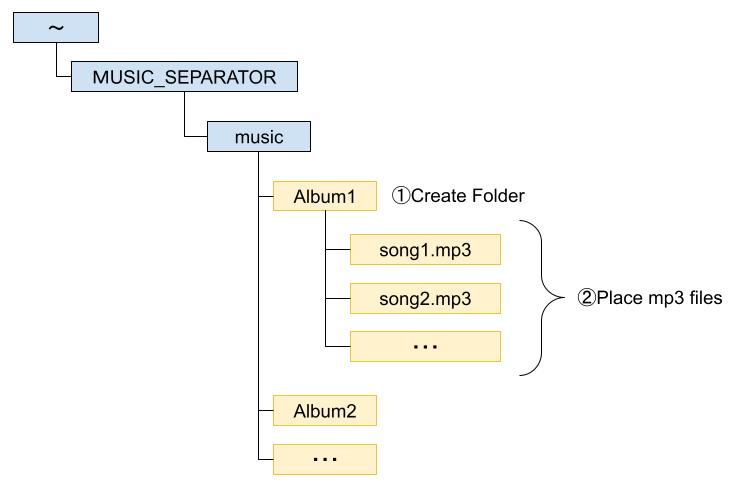
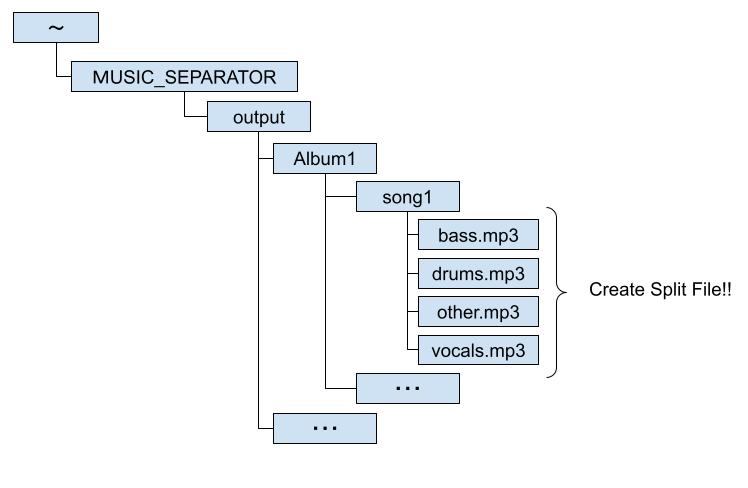

# Overview
Split mp3 file using 'demucs'

# demo
|Setting(before execution)|Result(After execution)|
|---|---|
|||

# Requirement
* CUDA Toolkit 11.8.0
* Python 3.11.0
* [Other Python Library](requirements.txt)

# Installation

#### Install Python Liberary
```Python
# Create python venv 
python -m venv venv

# venv activate
venv\Scripts\activate

# Install Python Liberary
pip install -r requirements.txt
```

# Usage
#### Run the "run_demucs.bat"

# Note
Change "PROGRAM_ROOT" of "run_demucs.py" to your own program location folder before execution

# Author
[twitter](https://twitter.com/RNxtxsx)
